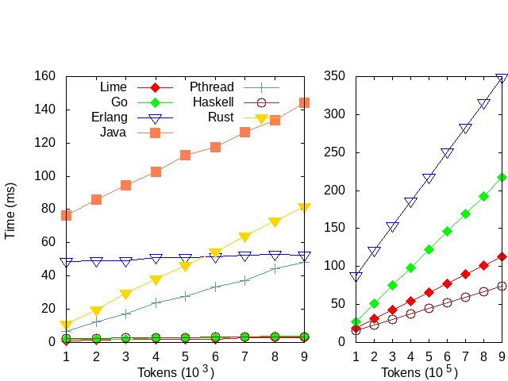

# PingPong Benchmark

The PingPong problem is used in https://www.scala-lang.org/old/node/54 to
illustrate actors in Scala: a "ball" is repeatedly passed back and forth between
two actors. In https://doi.org/10.1145/2687357.2687368 the problem is part of a
suite of micro-benchmarks that evaluate specific implementation aspects of
actors. The number of actors is small and fixed, so there is no overhead of
creation, but only the actor with the ball can be active, so there is no
parallelism involved.

Here, we use it to evaluate the efficiency of synchronous communication. The
Ping player sends the "ball" and its own address to the Pong player, who sends
the "ball" back again to the received address. The number of remaining bounces
is decremented by both Ping and Pong. The program terminates when it reaches 0.

The constants used in the implementations are:
- Rounds: the number of bounces of the ball

# Experimental Environment

The experiments are run on AMD Ryzen Threadripper 1950X 16-CoreProcessor (2.09GHz). 

* OS: Ubuntu 16.4 LTS in single-user mode
* Gcc: 5.4.0 
* Java HotSpot: 1.8.0
* Go: 1.8
* Erlang: 20
* GHC: 8.4.2
* Rust: 1.24.1

This experiment is run sixty times. The results reported here are the average with a 95% confidence interval. 

Due to the starting up time of the VM, the starting up time (1100ms) is subtracted from the total execution time for the Erlang implementation. 

# Result

