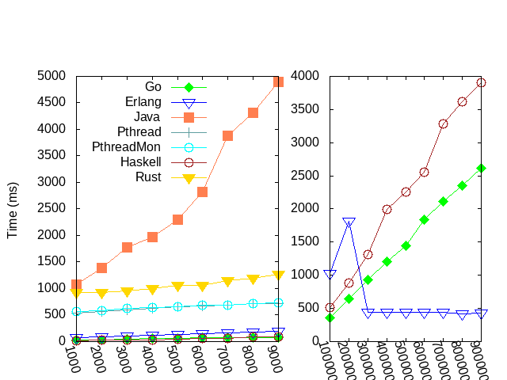

# ThreadRing Benchmark

The ThreadRing problem is used in
https://github.com/berkus/theron/tree/master/Benchmarks/ThreadRing to illustrate
actors in the Theron C++ actor library: nodes are arranged in a ring and a token
is repeatedly forwarded from one node to the next one. The token is an integer
value that is decremented with every hop. The node at which the value reaches 0
prints its id. In https://doi.org/10.1145/2687357.2687368 the problem is part of
a suite of micro-benchmarks that evaluate specific implementation aspects of
actors.

Like with the PingPong benchmark, only one process can be active at any time.
Unlike with the PingPong benchmark, there is larger number of processes,
significantly larger than the number of processor cores. Thus this benchmark
evaluates the efficiency of context-switching and allocating a processor cores
to the ready process.

The constants used in the implementations are:
- Hops: the number of hops the token takes
- Nodes: the number of nodes in the ring

# Experimental Environment

The experiments are run on AMD Ryzen Threadripper 1950X 16-CoreProcessor (2.09GHz). 

* OS: Ubuntu 16.4 LTS in single-user mode
* Gcc: 5.4.0 
* Java HotSpot: 1.8.0
* Go: 1.8
* Erlang: 20
* GHC: 8.4.2
* Rust: 1.24.1

This experiment is run sixty times. The results reported here are the average with a 95% confidence interval. The smallest and largest value are regarded as outliers and are deleted.

# Result

